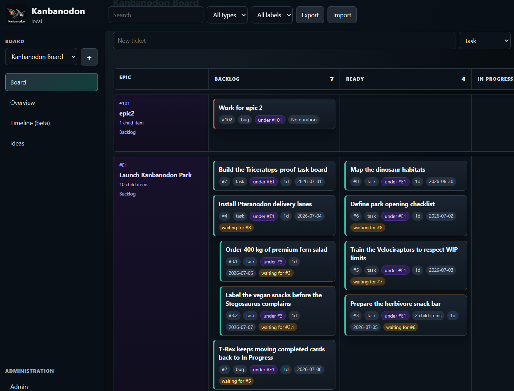
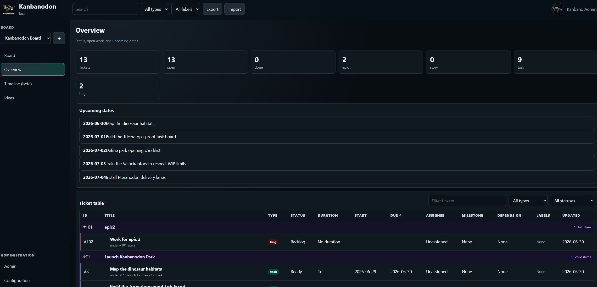
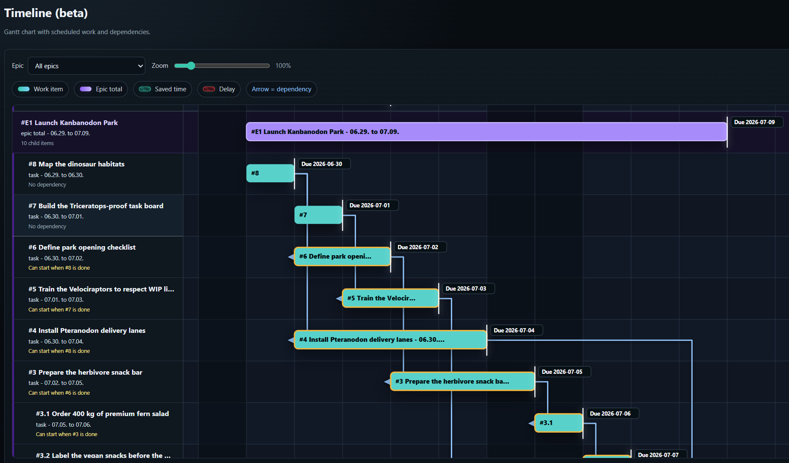
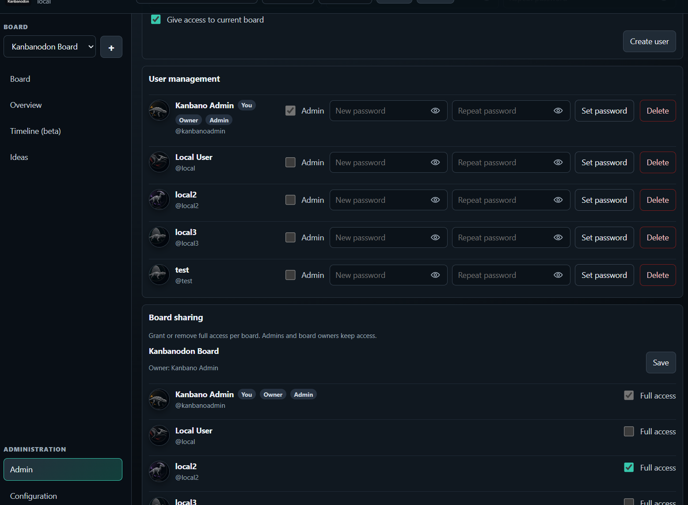
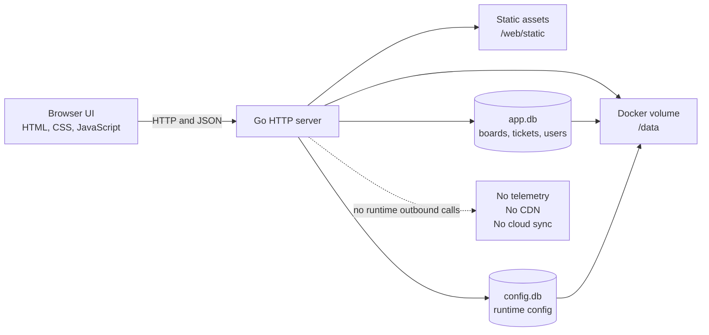
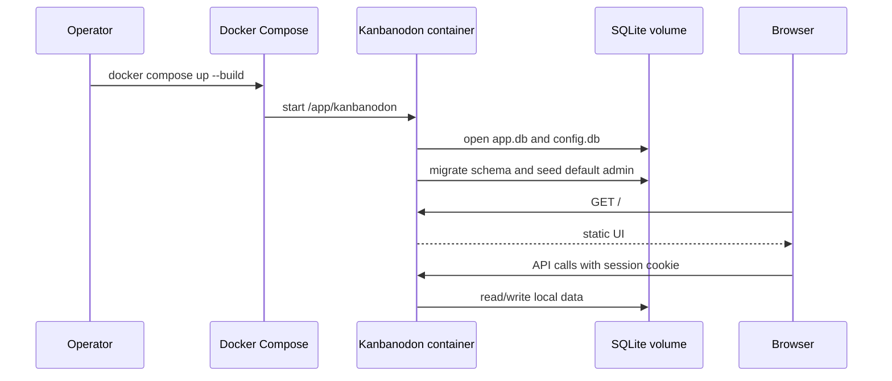
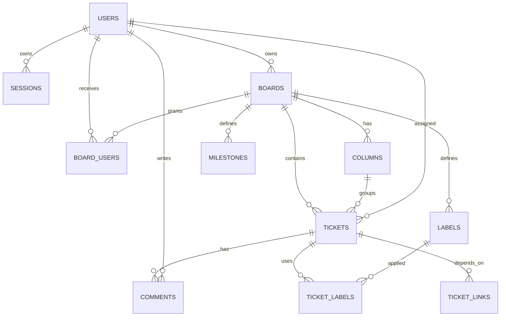
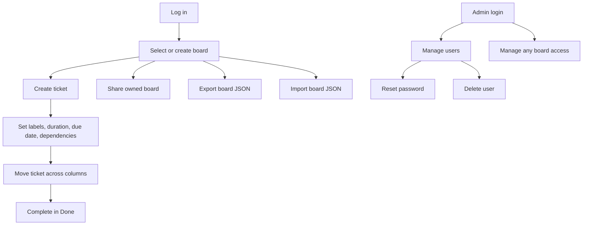

# Kanbanodon

Kanbanodon is a small, private Kanban board for people who want to structure their work without starting a large project-management platform.

The project exists for three simple reasons:

1. I wanted something fast to start and stop, with a minimal footprint. Kanbanodon should run as one container, with one local data volume, and no extra database server to operate.
2. I did not want my work data to leave my machine or server. Kanbanodon has no telemetry, no cloud sync, no external fonts, no CDN assets, and no runtime calls to third-party services.
3. My son is in his dinosaur phase, so the name and visual style became dinosaur-shaped on purpose.

Kanbanodon is free to run, uses local SQLite files, and is designed for personal work or a small trusted team.

## Quick Start

Prerequisites:

- Docker with Docker Compose
- A modern browser

Start the app:

```bash
docker compose up --build
```

Open:

```text
http://localhost:8080
```

On first start, Kanbanodon creates a default admin account:

```text
Username: kanbanoadmin
Password: kanbanopw
```

You must change this password after login. Also change `KANBANODON_SESSION_SECRET` in `docker-compose.yml` before using the app for real work.

## What It Does

- Kanban board with drag and drop
- Multiple boards
- Local users, passwords, admin roles, and dino avatars
- Board access management per user
- Work items with epics, stories, tasks, bugs, visible references, one optional parent, labels, dates, assignees, milestones, and dependencies
- Comments per ticket
- Overview table with sorting and filters
- Independent ideas list without delivery dates
- Timeline (beta)/Gantt view based on scheduled work and dependencies
- JSON export and import
- Local SQLite storage
- One-container deployment

## Screenshots

Board view with Epic swimlanes:



Overview with status cards and grouped ticket table:



Timeline (beta) with Epic grouping, dependency arrows, zoom, and path highlighting:



Admin area with user management and per-board sharing:



## Architecture



The language split is intentional:

- Go owns HTTP routing, authentication, authorization, SQLite access, imports, exports, and server-side validation.
- JavaScript owns browser interaction, rendering, drag and drop, filters, and the timeline visualization.
- HTML and CSS define the local UI shell and styling.

This keeps private data and trusted rules on the server, while keeping UI behavior in the browser where it belongs.

## Runtime Flow



## Data Storage

Kanbanodon stores data in two local SQLite databases under `KANBANODON_DATA_DIR`. SQLite is an embedded relational database: there is no separate database server, just ordinary `.db` files read and written by the Go process.

Default in Docker:

```text
/data
```

Files:

- `app.db`: users, sessions, boards, board access, columns, tickets, labels, ticket links, comments, and milestones
- `config.db`: runtime configuration such as auth mode

The Docker Compose file mounts `/data` as the named volume `kanbanodon-data`.

Back up the data volume:

```bash
docker run --rm -v kanbanodon-data:/data -v "$PWD:/backup" alpine tar czf /backup/kanbanodon-data.tgz -C /data .
```

Restore into an empty volume:

```bash
docker run --rm -v kanbanodon-data:/data -v "$PWD:/backup" alpine sh -c "cd /data && tar xzf /backup/kanbanodon-data.tgz"
```

You can also export one board as JSON from the top bar.

## Data Model



## Database Schema

`app.db` schema:

```sql
create table users (
  id integer primary key,
  username text unique not null,
  name text not null,
  email text unique not null,
  password_hash text not null,
  avatar text not null,
  is_admin integer not null default 0,
  must_change_password integer not null default 0,
  created_at text not null
);

create table sessions (
  token_hash text primary key,
  user_id integer not null,
  expires_at text not null
);

create table boards (
  id integer primary key,
  name text not null,
  owner_id integer not null default 0,
  created_at text not null
);

create table board_users (
  board_id integer not null,
  user_id integer not null,
  full_access integer not null default 1,
  primary key (board_id, user_id)
);

create table columns (
  id integer primary key,
  board_id integer not null,
  name text not null,
  position integer not null
);

create table milestones (
  id integer primary key,
  board_id integer not null,
  name text not null,
  due_date text not null
);

create table tickets (
  id integer primary key,
  board_id integer not null,
  column_id integer not null,
  parent_id integer not null default 0,
  ref text not null default '',
  title text not null,
  body text not null default '',
  type text not null default 'task',
  points integer not null default 0,
  duration integer not null default 0,
  start_date text not null default '',
  due_date text not null default '',
  completed_at text not null default '',
  milestone_id integer not null default 0,
  assignee_id integer not null default 0,
  position integer not null default 0,
  created_at text not null,
  updated_at text not null
);

create table labels (
  id integer primary key,
  board_id integer not null,
  name text not null,
  color text not null
);

create table ticket_labels (
  ticket_id integer not null,
  label_id integer not null,
  primary key (ticket_id, label_id)
);

create table ticket_links (
  from_ticket_id integer not null,
  to_ticket_id integer not null,
  primary key (from_ticket_id, to_ticket_id)
);

create table comments (
  id integer primary key,
  ticket_id integer not null,
  user_id integer not null,
  body text not null,
  created_at text not null
);
```

`config.db` schema:

```sql
create table config (
  key text primary key,
  value text not null,
  updated_at text not null
);
```

## Configuration

Environment variables:

| Variable | Default | Purpose |
| --- | --- | --- |
| `KANBANODON_ADDR` | `:8080` | HTTP listen address inside the container |
| `KANBANODON_DATA_DIR` | `data` locally, `/data` in Docker | Directory for SQLite files |
| `KANBANODON_AUTH_MODE` | `local` | Stored and shown as the runtime mode |
| `KANBANODON_ALLOW_SIGNUP` | `true` | Allows users to create their own accounts from the login screen |
| `KANBANODON_SESSION_SECRET` | `change-me-kanbanodon` | Secret used to sign session tokens |

Recommended production-like local settings:

```yaml
environment:
  KANBANODON_ADDR: ":8080"
  KANBANODON_DATA_DIR: "/data"
  KANBANODON_AUTH_MODE: "local"
  KANBANODON_ALLOW_SIGNUP: "false"
  KANBANODON_SESSION_SECRET: "replace-with-a-long-random-secret"
```

The default Compose file binds the app to localhost only:

```yaml
ports:
  - "127.0.0.1:8080:8080"
```

Keep this binding if Kanbanodon should only be reachable from the same machine.

## Deployment

Build and start:

```bash
docker compose up --build -d
```

View logs:

```bash
docker compose logs -f
```

Stop:

```bash
docker compose down
```

Stop and remove the data volume:

```bash
docker compose down -v
```

Only use `-v` when you intentionally want to delete all stored Kanbanodon data.

## User Management

Create users:

- Admins can create users from `Admin` with username, initial password, and optional access to the current board.
- Admin-created users must change their initial password after login.
- If `KANBANODON_ALLOW_SIGNUP=true`, users can sign up from the login screen.
- New users are regular users, not admins.
- New users do not automatically receive existing board access.
- A user can create their own board from the sidebar.
- The user who creates a board becomes that board's owner.

Kanbanodon currently does not ask for email addresses when creating or registering users. There is no mail delivery feature yet, so email addresses would not be used for password resets, invites, or notifications. The SQLite schema still contains an internal `email` column for compatibility with earlier local data, but new accounts are created from username and password only.

Manage users:

1. Log in as an admin.
2. Open `Admin`.
3. Use the `Create user` section to add a new account.
4. Use the `User management` section to promote or demote users, reset passwords, or delete accounts.
5. Use the `Board sharing` section to grant or remove access per board, then save the board whose access changed.

Delete behavior:

- Admins cannot delete their own account.
- Kanbanodon keeps at least one admin account.
- Deleting a user removes their sessions, board access, and comments.
- Tickets assigned to the deleted user are set back to unassigned.

Board sharing:

- Regular users see `Sharing` under `Access`.
- Board owners can open `Sharing` and grant or remove `Full access` for other users on their own boards.
- Users without owned boards see that no boards are available to share yet.
- Board owners cannot manage access for boards they do not own.
- Board owner access cannot be removed from the board.
- Admins can open `Admin` and use the separate `Board sharing` section to manage access for every board.
- Each board has its own `Save` button so access changes are confirmed per board.
- Admin users have implicit access to all boards.

## Menus And Screens

Top bar:

- `Search`: filters the current board view.
- `All types`: filters by `epic`, `story`, `task`, or `bug`.
- `All labels`: filters by label.
- `Export`: downloads the selected board as JSON.
- `Import`: imports tickets from a Kanbanodon JSON export into the selected board.
- Account menu: change your password or log out.

Sidebar:

- `Board`: shows columns and draggable ticket cards.
- `Overview`: shows a sortable table for scanning and comparing work.
- `Timeline (beta)`: shows a Gantt-style view from start dates, due dates, durations, and dependencies.
- `Ideas`: collects independent ideas that do not need due dates and do not appear in the board timeline.
- `Sharing`: shown to regular users under `Access`; board owners can grant or remove access to their own boards.
- `Admin`: shown to admins under `Administration`; contains separate sections for creating users, managing users, and sharing boards.
- `Configuration`: shows current board/system facts.

Ticket drawer:

- Edit title, description, type, one optional parent, duration, dates, assignee, milestone, labels, and dependencies.
- Ideas use a smaller editor with title, notes, type, and labels only.
- Add comments.
- Delete the ticket.

Dependency behavior:

- A ticket can depend on other tickets.
- Moving a ticket into active work is blocked while its dependencies are not in `Done`.
- Moving a ticket to `Done` stores `completed_at`, which is used by the timeline.

## Main Use Cases



## Privacy And Security

- No outbound runtime connections
- No telemetry
- No external fonts or CDN assets
- HTTP-only session cookies
- Passwords are hashed before storage
- Local SQLite databases in the configured data directory
- Localhost-only port binding in the default Compose file

Important operational notes:

- Change the default admin password immediately.
- Change `KANBANODON_SESSION_SECRET` before real use.
- Use a reverse proxy with TLS if you expose Kanbanodon beyond localhost.
- Back up the Docker volume if the data matters.

## Development

Prerequisites for local development:

- Go 1.22 or newer
- Node.js for JavaScript syntax checks and avatar tests

Run the Go tests:

```bash
go test ./...
```

Check browser JavaScript syntax:

```bash
node --check web/static/app.js
node --check web/static/dino-avatar.js
```

Run all browser-side unit and asset tests:

```bash
node --test web/static/*.test.js
```

Build the server locally:

```bash
go build ./cmd/server
```

## Repository Layout

```text
cmd/server/          Go HTTP server, auth, SQLite persistence, tests
web/static/          Browser UI, styles, dino avatar assets
docs/                Screenshots and generated avatar reference material
data/                Local development databases, ignored by Git
Dockerfile           One-container image
docker-compose.yml   Local deployment
```

## Design Notes

Kanbanodon intentionally stays small:

- SQLite instead of a separate database server
- Static browser assets instead of a frontend build chain
- One Go binary inside one container
- JSON APIs instead of additional service layers
- Local-first operation instead of hosted sync

That keeps the project easy to start, stop, inspect, back up, and delete.
