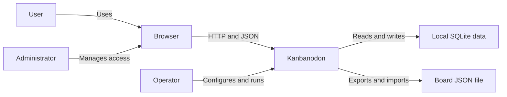
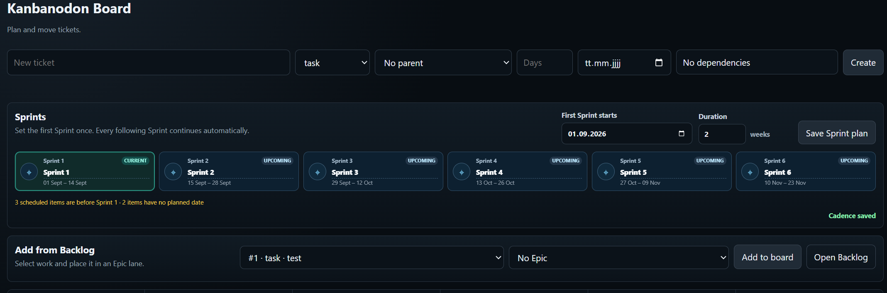
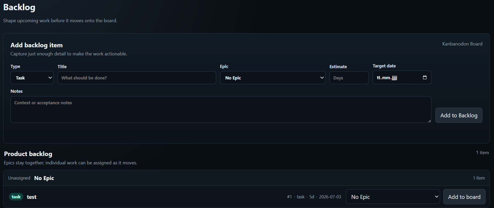
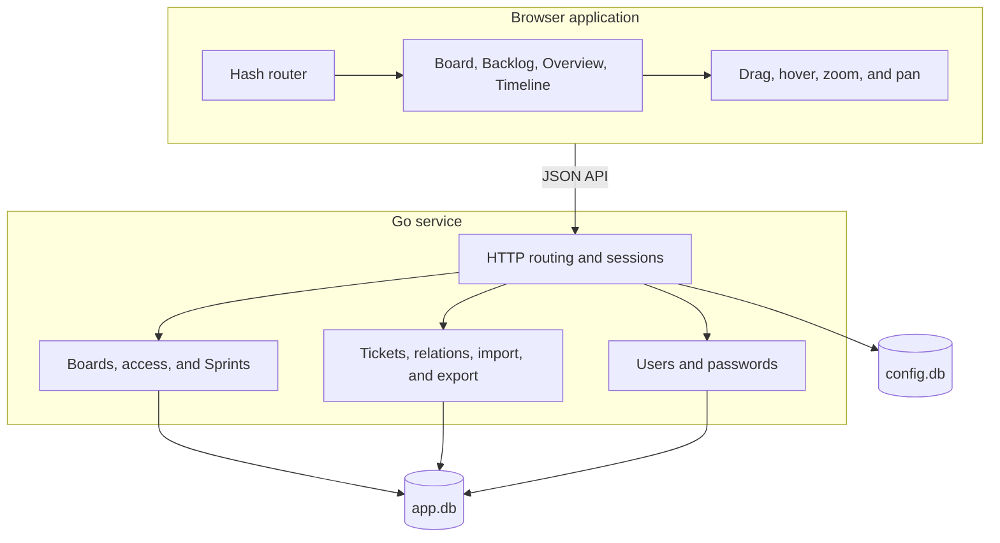
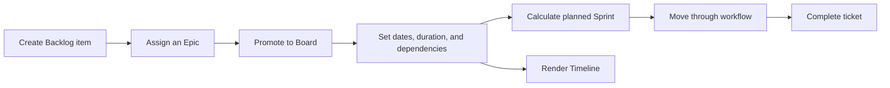
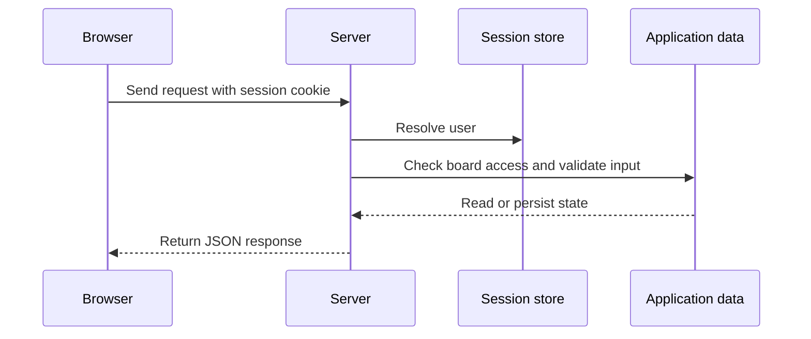
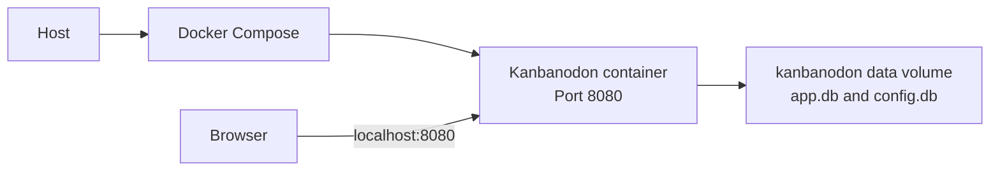

# Kanbanodon

Kanbanodon is a compact, self hosted Kanban application for personal work and small teams. It combines an Epic based board, a product backlog, Sprint planning, an overview table, and an interactive timeline in one Go service.

The application runs in a single container and stores its data in local SQLite databases. It does not require a separate database server, external fonts, cloud synchronization, telemetry, or runtime calls to third party services.

## Purpose and goals

Kanbanodon keeps planning, delivery status, dependencies, and time based projections in one local application. Work can begin as an item in the Product Backlog, move to an Epic lane on the Board, and remain visible through Overview and Timeline until completion.

| Priority | Goal | Result |
| --- | --- | --- |
| 1 | Data ownership | Board and account data remain in the configured local data directory |
| 2 | Clear planning | Backlog, Sprints, dependencies, delays, and estimates use the same ticket data |
| 3 | Simple operation | One service and one data volume are sufficient |
| 4 | Direct interaction | Common planning actions work without page reloads or a frontend build chain |

### Users and responsibilities

| Role | Responsibilities |
| --- | --- |
| User | Creates, plans, moves, and completes work on accessible boards |
| Board owner | Manages access to boards they own |
| Administrator | Manages accounts, roles, passwords, and access to all boards |
| Operator | Runs the service, protects the session secret, and backs up the data volume |

## Constraints

| Constraint | Consequence |
| --- | --- |
| Go 1.22 | Server code and migrations use the Go standard HTTP stack with `modernc.org/sqlite` |
| Local SQLite storage | No separate database server is required |
| Static browser application | HTML, CSS, and JavaScript are served by the Go process |
| Single container deployment | Application and static assets are built into one image |
| Local authentication | Accounts and sessions are managed by Kanbanodon |
| No runtime external services | Core operation does not depend on cloud APIs, telemetry, fonts, or CDN assets |

## System context



The browser is the only user facing client. Kanbanodon serves the interface and its JSON API from the same address. All trusted validation and authorization remain in the Go service. Board exports are explicit file operations initiated from the interface.

## Features and screenshots

| Area | Capabilities |
| --- | --- |
| Board | Epic swimlanes, drag and drop, configurable workflow columns, ticket creation, dependency context, Sprint labels |
| Backlog | Epics, stories, tasks, and bugs, grouping by Epic, inline Epic assignment, individual promotion, complete Epic promotion |
| Sprints | Start date, duration in whole weeks, automatic continuation, editable names, current Sprint plus five upcoming Sprints |
| Overview | Status summary, upcoming dates, filters, sorting, Sprint assignment, dependency visualization |
| Timeline | Gantt view, Epic totals, live delay status, best case estimates, Sprint bands, zoom, horizontal panning, date cursor |
| Tickets | Description, reference, type, parent, duration, dates, assignee, milestone, labels, dependencies, comments |
| Access | Local accounts, administrator roles, board ownership, access management, password changes, optional signup |
| Data | Local SQLite storage, board export and import as JSON |

### Sprint planning and board

Sprint cadence, editable Sprint names, Backlog promotion, and the delivery board share one planning view.



### Product backlog

Backlog items remain outside the delivery board until they are promoted individually or together with an Epic.



## Solution strategy

| Concern | Approach |
| --- | --- |
| Delivery | Compile one Go binary and copy it with the static browser assets into one container |
| Persistence | Store relational application data in `app.db` and runtime configuration in `config.db` |
| Compatibility | Run additive schema migrations during startup and preserve older local data |
| Security | Validate sessions, board access, administrative actions, and ticket relations on the server |
| Planning | Derive Sprint assignment, Timeline ranges, delays, and estimates from persisted ticket dates and durations |
| Interaction | Render all views in the browser and keep the selected board and route in client state |

## Building blocks



### Browser application

`web/static/index.html` provides the application shell. `web/static/app.js` loads state, renders views, validates browser input, and coordinates interactions. `web/static/route.js` keeps board, ticket, view, and focused Sprint in the URL. `web/static/styles.css` contains the complete visual system.

### Go service

`cmd/server/main.go` configures the service and its routes. Board settings, Sprint names, and access are handled in `boards.go`. Ticket operations, dependencies, and board import and export are handled in `tickets.go`. Account and password operations are handled in `auth.go` and `users.go`.

### Persistence

`cmd/server/migrate.go` creates and upgrades both SQLite databases. `app.db` contains users, sessions, boards, access rules, Sprint settings, Sprint names, workflow columns, tickets, labels, dependencies, comments, and milestones. `config.db` contains runtime configuration.

## Runtime scenarios

### Planning and delivery



The Board uses Epic swimlanes and the default workflow `To Do`, `Ready`, `In Progress`, `Review`, and `Done`. Active work is blocked while an unfinished dependency remains. Moving a ticket to `Done` records its completion time for Timeline calculations.

The Product Backlog supports the same work types and ticket fields as the Board. Backlog tickets are excluded from delivery views until promotion. A ticket can be assigned to an Epic during promotion, and a complete Epic package can be promoted together.

### Authenticated request



The server performs access checks for every protected endpoint. Administrative actions require an administrator account. Board scoped operations require ownership, explicit access, or administrator status.

## Planning rules

### Board and dependencies

Dependency indicators show both directions. A ticket identifies what it depends on and which work it enables. Hovering a ticket, Epic lane, or dependency connection keeps the related chain visible and fades unrelated work. The `No epic` lane applies the same focus behavior to standalone tickets.

### Sprints

Each board stores the first Sprint start date and a duration from 1 to 52 whole weeks. Following Sprints are calculated automatically. The Board shows the current Sprint and the next five Sprints, or the first six Sprints when the cadence has not started yet.

Sprint names can be edited directly in their cards and are saved for the selected board. Clearing a custom name restores the generated `Sprint N` label. The focus icon on a Sprint card opens Timeline with that Sprint centered.

A ticket is assigned to the Sprint in which it is planned to finish. Its due date is used when available. Otherwise Kanbanodon uses the start date and duration. Tickets planned before the configured cadence are shown as `Before Sprint 1`; tickets without a usable date remain unscheduled.

### Timeline

Timeline derives its range from scheduled work and displays work items, Epic totals, dependencies, delays, estimates, and Sprint boundaries on a shared daily grid.

Overdue unfinished work extends from its due date to the current date as a red delay area. The remaining duration continues after the current date as a dashed best case estimate. Dependency paths use visible direction markers and become prominent together with their connected tickets on hover.

The zoom control changes the density of the daily grid while preserving the visible center. The graph can be moved horizontally by holding and dragging. A vertical cursor snaps to the daily grid and displays the corresponding date. Sprint bands alternate subtly, and a Sprint opened from the Board receives a restrained focus treatment.

## Deployment



### Quick start

Docker with Docker Compose and a modern browser are required.

1. Start Kanbanodon.

   ```bash
   docker compose up --build
   ```

2. Open `http://localhost:8080`.

3. Sign in with the initial administrator account.

   ```text
   Username: kanbanoadmin
   Password: kanbanopw
   ```

4. Change the initial password after login.

5. Set a unique value for `KANBANODON_SESSION_SECRET` before using the application with real data.

Stop the application with:

```bash
docker compose down
```

### Configuration

| Variable | Default | Purpose |
| --- | --- | --- |
| `KANBANODON_ADDR` | `:8080` | HTTP listen address inside the container |
| `KANBANODON_DATA_DIR` | `data` locally, `/data` in Docker | Directory containing the SQLite databases |
| `KANBANODON_AUTH_MODE` | `local` | Authentication mode reported by the application |
| `KANBANODON_ALLOW_SIGNUP` | `true` | Enables account registration from the login screen |
| `KANBANODON_SESSION_SECRET` | `change-me-kanbanodon` | Secret used to sign session tokens |

The supplied Compose configuration publishes the application on `127.0.0.1:8080`. Keep this binding when Kanbanodon should only be available on the same machine. Use a reverse proxy with TLS before exposing it through a network.

### Storage and export

Docker Compose mounts `/data` as the named volume `kanbanodon-data`. Protect this volume with the backup method used by the host environment. Each board can also be exported as JSON from the top bar and imported into another Kanbanodon instance.

## Shared concepts

| Concept | Implementation |
| --- | --- |
| Authentication | A signed session cookie identifies a locally stored session |
| Authorization | Board access and administrator permissions are checked by the Go service |
| Passwords | Password hashes are stored instead of plaintext passwords |
| Validation | Dates, Sprint duration, ticket relations, access changes, and workflow moves are checked before persistence |
| Migration | Startup migrations add required tables and columns while retaining existing records |
| Time | Dates use calendar days; completion timestamps provide the finished state for delay calculations |
| Dependencies | Directed ticket links determine blocking rules and visual connection paths |
| Routing | Hash routes preserve the selected view, board, ticket, and focused Sprint |
| Privacy | Static assets are bundled and core operation has no runtime dependency on external services |

## Architecture decisions

| Decision | Rationale |
| --- | --- |
| One Go process | Keeps deployment and local operation small |
| SQLite persistence | Provides relational storage without a database service |
| Server side authorization | Prevents browser state from becoming a trust boundary |
| Static JavaScript interface | Avoids a separate frontend toolchain and runtime |
| Calculated Sprint sequence | A single cadence avoids maintaining separate Sprint records for every interval |
| Date driven Sprint assignment | Board, Overview, and Timeline derive the same planned Sprint from ticket data |
| Explicit Backlog state | Work type and delivery readiness remain independent concepts |
| URL based Sprint focus | A Timeline focus can survive reloads and direct navigation |

## Quality requirements

| Scenario | Expected behavior |
| --- | --- |
| Existing data is opened after an update | Startup migrations retain existing boards and add required schema changes |
| A user requests an inaccessible board | The server rejects the request without returning board data |
| A ticket with open dependencies enters active work | The move is rejected and the stored status remains unchanged |
| Sprint cadence changes | Board, Overview, and Timeline use the new calculation after the save completes |
| A Sprint focus link is opened | Timeline centers the requested Sprint and preserves the focus in the route |
| The service restarts with the same data volume | Accounts, boards, Sprint names, and tickets remain available |
| Runtime network access is unavailable | Core planning and board functions remain usable on the local host |

## Risks and limitations

| Topic | Current limitation |
| --- | --- |
| Scaling | The current deployment model is one application process with local SQLite files |
| Transport security | TLS termination is not included and must be provided before network exposure |
| Account recovery | There is no mail integration; password recovery is an administrator action |
| Sprint capacity | Sprint assignment is based on planned finish dates and does not calculate team capacity |
| Backups | Persistent volume backups are an operator responsibility |
| Large boards | No performance target is currently defined for unusually large ticket sets |

## Development

Local development requires Go 1.22 or newer and Node.js.

Run the server tests:

```bash
go test ./...
```

Run the browser tests:

```bash
node --test web/static/*.test.js
```

Check the main browser source:

```bash
node --check web/static/app.js
```

Build the server:

```bash
go build ./cmd/server
```

### Repository layout

```text
cmd/server/          Go server, SQLite persistence, migrations, and tests
web/static/          Browser application, styles, routes, and avatar assets
docs/screenshots/    Product screenshots used by this README
Dockerfile           Container image
docker-compose.yml   Local runtime configuration
```

## Glossary

| Term | Meaning |
| --- | --- |
| Backlog item | Work stored outside the delivery Board |
| Board item | Work promoted into a workflow column |
| Epic | Parent work item used as a Board swimlane and Backlog group |
| Dependency | Directed relation that requires another ticket to be completed first |
| Sprint cadence | Repeating interval calculated from one start date and a duration in weeks |
| Planned finish | Due date, or start date plus ticket duration when no due date exists |
| Best case estimate | Remaining duration displayed after the current date for overdue unfinished work |
