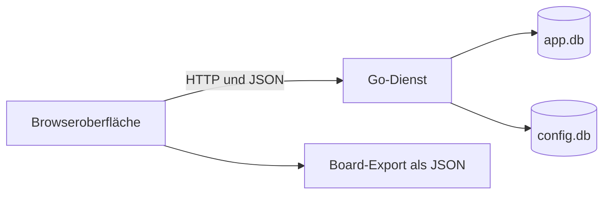

# Kanbanodon

Kanbanodon ist eine schlanke, selbst betriebene Kanban-Anwendung für Einzelpersonen und kleine Teams. Aufgaben lassen sich mit einem Titel anlegen, auf dem Board bearbeiten und abschließen. Backlog, Checklisten, Zuständigkeiten und Kommentare ergänzen den einfachen Arbeitsablauf. Epics, Abhängigkeiten, Sprints und Timeline stehen bei Bedarf zur Verfügung.

Die Anwendung läuft als einzelner Go-Dienst mit einer statischen Browseroberfläche und lokalen SQLite-Datenbanken. Ein zusätzlicher Datenbankserver oder ein Cloudkonto ist nicht erforderlich. Die Oberfläche und ihre Bilddateien werden mitgeliefert; im Betrieb gibt es keine Abhängigkeit von externen Schrift-, Bild- oder Analysediensten.

## Erste Schritte

1. Registrieren oder mit einem vorhandenen Konto anmelden.
2. Mit „Create first board“ ein Board anlegen oder ein freigegebenes Board auswählen.
3. Einen Titel in „New ticket“ eingeben und mit „Create task“ oder Enter bestätigen.
4. Die Karte öffnen und unter „Status“ den Arbeitsstand ändern. Alternativ die Karte in eine andere Spalte ziehen.
5. Zum Abschließen „Done“ wählen und speichern.

Die Standardspalten sind „To Do“, „Ready“, „In Progress“, „Review“ und „Done“. Für diesen Ablauf sind weder Sprintplanung noch Epics, Dauer oder Termine nötig. Karten können mit Tab und Enter geöffnet werden. Ungespeicherte Editoränderungen werden beim Schließen, Wechseln und Abmelden durch eine Rückfrage geschützt.

Weitere Bedienhinweise stehen unter [Aufgaben organisieren](docs/task-tools.md). Die [Dino-Avatare](docs/avatars.md) werden Konten automatisch zugewiesen.

## Ansichten und Aufgaben

| Bereich | Verwendung |
| --- | --- |
| Board | Aktive Aufgaben anlegen und durch die Arbeitsspalten bewegen; Epics können Aufgaben in Zeilen gruppieren |
| Backlog | Bevorstehende Arbeit sammeln und einzelne Aufgaben oder ein vollständiges Epic auf das Board übernehmen |
| Overview | Status, Zuständigkeiten und anstehende Termine prüfen; Aufgaben filtern und sortieren |
| Timeline | Zeiträume, Abhängigkeiten, Epic-Summen und Terminüberschreitungen auf einer Zeitachse betrachten |
| Board-Menü | Archiv, Papierkorb, Freigabe und JSON-Import/-Export aufrufen |

Eine Aufgabe kann Beschreibung, Checkliste, Zuständigkeit, Fälligkeit, Labels, Dauer, Startdatum, Meilenstein, übergeordnete Aufgabe und Abhängigkeiten enthalten. Kommentare ergänzen die Zusammenarbeit. Erwähnungen und Zuweisungen durch andere Benutzer erzeugen Benachrichtigungen innerhalb der Anwendung.

„Duplicate“ erstellt eine Kopie mit zurückgesetztem Arbeitsstand. Archiv und Papierkorb entfernen Aufgaben aus den aktiven Ansichten; beide erlauben die Wiederherstellung. Wiederkehrende Aufgaben erzeugen ihren Nachfolger beim Abschluss, nicht nach einem unabhängigen Kalender.

## Optionale Planung

### Epics und Abhängigkeiten

Epics bündeln größere Vorhaben. Stories können einem Epic untergeordnet sein; Tasks und Bugs können zu einem Epic oder einer Story gehören. Ein Board ohne Epics verwendet die verfügbare Breite für seine Arbeitsspalten.

Abhängigkeiten zeigen, welche Aufgaben zuerst erledigt werden müssen und welche Arbeit dadurch ermöglicht wird. Offene Abhängigkeiten verhindern den Wechsel in „In Progress“ und nachfolgende Spalten. Abhängigkeitszyklen werden vom Server abgewiesen. Ziehen einer Karte ändert ihren Status; eine andere Zuordnung wird im Editor über „Parent“ vorgenommen.

### Sprints

„Sprint planning“ lässt sich auf dem Board öffnen. Ein Board speichert den ersten Sprintbeginn und eine Dauer von 1 bis 52 ganzen Wochen. Weitere Sprints werden daraus berechnet. Angezeigt werden der aktuelle und die nächsten fünf Sprints; vor dem ersten Beginn erscheinen die ersten sechs.

Sprintnamen können direkt bearbeitet werden. Ohne eigenen Namen erscheint „Sprint N“. Die Fokusaktion öffnet den jeweiligen Sprint in Timeline.

Die Sprintzuordnung einer Aufgabe folgt ihrem geplanten Abschluss: Fälligkeit, falls vorhanden, sonst Startdatum plus Dauer. Aufgaben ohne brauchbares Datum bleiben ungeplant. Die Zuordnung berechnet keine Teamkapazität.

### Overview und Timeline

Overview und Timeline sind unter „Planning“ erreichbar. Overview zeigt zunächst fünf zentrale Tabellenspalten; zusätzliche Planungsspalten lassen sich einblenden.

Timeline verwendet gespeicherte Dauer und Termine. Bei fehlender Dauer nimmt sie drei Tage für normale Aufgaben und einen Tag für Epics an. Ohne Startdatum wird der Beginn aus der Fälligkeit und Dauer oder aus dem Erstellungsdatum hergeleitet. Die Oberfläche weist auf diese Annahmen hin; sie werden nicht als Termine in der Aufgabe gespeichert.

Nicht erledigte Aufgaben können eine rote Verzögerung bis zum aktuellen Datum und danach eine gestrichelte Schätzung anzeigen. Abhängigkeiten und Epic-Summen erscheinen im selben Zeitraster. Zoom verändert die Dichte; Ziehen bewegt die Zeitachse horizontal. Der Datumszeiger zeigt den Kalendertag unter dem Mauszeiger.

## Konten und Berechtigungen

| Rolle | Aufgaben |
| --- | --- |
| Benutzer | Aufgaben auf zugänglichen Boards anlegen, bearbeiten und abschließen |
| Board-Eigentümer | Zugriff auf eigene Boards verwalten |
| Administrator | Konten, Rollen, Passwortzurücksetzungen und Zugriffe auf alle Boards verwalten |
| Betreiber | Dienst konfigurieren, Transport absichern und Daten sichern |

Die Registrierung kann über `KANBANODON_ALLOW_SIGNUP` abgeschaltet werden. Administratoren können weiterhin Konten anlegen. Avatare werden auf dem Server automatisch vergeben.

Ein Administrator-Passwortreset meldet das betroffene Konto auf allen Geräten ab. Ein eigener Passwortwechsel erhält die aktuelle Sitzung und meldet andere Sitzungen ab. Passwortwiederherstellung erfolgt über einen Administrator; eine E-Mail-Wiederherstellung ist nicht vorhanden.

## Installation und Betrieb

### Docker Compose

Voraussetzungen sind Docker mit Docker Compose und ein moderner Browser.

1. In `docker-compose.yml` den Wert für `KANBANODON_SESSION_SECRET` durch einen eigenen, langen Zufallswert ersetzen.
2. Die Anwendung starten:

   ```sh
   docker compose up -d --build
   ```

3. Im Browser [localhost:8080](http://localhost:8080) öffnen.
4. Bei einer frischen Installation mit dem Administratorkonto anmelden:

   ```text
   Benutzername: kanbanoadmin
   Passwort: kanbanopw
   ```

5. Das angeforderte neue Administratorpasswort setzen.

Die mitgelieferte Compose-Konfiguration bindet den Dienst an `127.0.0.1:8080`. Damit ist er zunächst nur auf demselben Rechner erreichbar. Für den Zugriff über ein Netzwerk sind eine passende Veröffentlichung des Ports und ein Reverse Proxy mit TLS erforderlich.

Stoppen:

```sh
docker compose down
```

### Konfiguration

| Variable | Standardwert des Dienstes | Bedeutung |
| --- | --- | --- |
| `KANBANODON_ADDR` | `:8080` | HTTP-Listenadresse |
| `KANBANODON_DATA_DIR` | `data` | Verzeichnis für die Datenbanken; im Docker-Container `/data` |
| `KANBANODON_AUTH_MODE` | `local` | Authentifizierungsmodus; für den normalen Betrieb `local` verwenden |
| `KANBANODON_ALLOW_SIGNUP` | `true` | Erlaubt die Registrierung |
| `KANBANODON_SESSION_SECRET` | `change-me-kanbanodon` | Geheimnis zum Signieren von Sitzungstokens; für den Betrieb ersetzen |

### Datenhaltung und Sicherung

Docker Compose verwendet das benannte Volume `kanbanodon-data`. Darin liegen `app.db` mit Anwendungsdaten und `config.db` mit Konfiguration und dem Initialisierungsstatus. Beide Dateien gehören zu einer vollständigen Sicherung. Für eine konsistente Dateisicherung den Dienst vorher stoppen oder ein für SQLite geeignetes Sicherungsverfahren verwenden.

Datenbankmigrationen laufen beim Start automatisch und erhalten vorhandene Daten. Das anfängliche Administratorkonto wird nur bei einer frischen Installation eingerichtet. Seine Löschung oder Herabstufung bleibt nach einem Neustart wirksam. Eine bereits eingerichtete Installation ohne Administrator benötigt eine Wiederherstellung aus einer geeigneten Sicherung; der Start stellt kein bekanntes Standardpasswort wieder her.

### Export und Import

Das Board-Menü exportiert ein Board als JSON. Ein Import fügt die enthaltenen Aufgaben dem ausgewählten Zielboard hinzu. Wiederholter Import erzeugt weitere Kopien. Konten und Zugriffsrechte werden nicht übertragen; Zuständigkeiten werden beim Import zurückgesetzt.

Checklisten, Wiederholungen, Archiv- und Papierkorbstatus sowie Kommentare mit Zeitpunkt und Autorname werden übertragen. Kommentarautoren werden als importiert gekennzeichnet und nicht mit gleich nummerierten Konten der Zielinstallation verbunden. Aktivitätsprotokolle und Benachrichtigungen gehören nicht zum Board-Export.

Ein Board-Export ergänzt die Datensicherung, ersetzt aber keine Sicherung der vollständigen Installation.

## Architektur


```mermaid
flowchart LR
    Browser["Browseroberfläche"] -->|HTTP und JSON| Server["Go-Dienst"]
    Server --> Daten[("app.db")]
    Server --> Konfiguration[("config.db")]
    Browser --> Datei["Board-Export als JSON"]
```

Der Go-Dienst liefert Oberfläche und API unter derselben Adresse aus. Er prüft Sitzungen, Boardzugriffe, Eingaben und Aufgabenbeziehungen vor dem Speichern. Die Datenhaltung verwendet SQLite über `modernc.org/sqlite`; ein separater Datenbankdienst ist nicht nötig.

Die Browseroberfläche besteht aus HTML, CSS und JavaScript. Hash-Routen halten Ansicht, Board, Aufgabe und Sprintfokus in der URL fest. Einlesen und Darstellen der Daten erfolgen im Browser; der Server bleibt für Berechtigungen und persistente Validierung zuständig.

| Bestandteil | Inhalt |
| --- | --- |
| `cmd/server/main.go` | Dienstkonfiguration und HTTP-Routen |
| `cmd/server/auth.go`, `users.go` | Konten, Sitzungen und Passwörter |
| `cmd/server/boards.go` | Boards, Freigaben und Sprintplanung |
| `cmd/server/tickets.go`, `task_features.go` | Aufgaben, Beziehungen, Kommentare, Wiederholungen und Datenaustausch |
| `cmd/server/migrate.go` | Aufbau und Migration der Datenbanken |
| `web/static/` | Browseroberfläche, Routing, Stile und mitgelieferte Bilder |
| `Dockerfile`, `docker-compose.yml` | Container und Betriebskonfiguration |

`app.db` enthält Konten, Sitzungen, Boards, Zugriffe, Aufgaben, Spalten, Sprintdaten, Labels, Abhängigkeiten, Kommentare, Meilensteine, Aktivität und Benachrichtigungen. `config.db` enthält Dienstkonfiguration und Initialisierungsstatus.

## Grenzen

Kanbanodon verwendet einen einzelnen Anwendungsprozess mit lokalen SQLite-Dateien. TLS-Terminierung und vollständige Datensicherungen übernimmt die Betriebsumgebung. Es gibt keine Cloud-Synchronisation oder E-Mail-Integration. Sprintplanung ordnet nach geplanten Abschlussdaten zu; sie berechnet weder Kapazitäten noch eine automatische Auslastungsplanung.
