# Kanbanodon

Kanbanodon is a small, private Kanban board for people who want to structure their work without starting a large project-management platform.

The project exists for three simple reasons:

1. I wanted something fast to start and stop, with a minimal footprint. Kanbanodon should run as one container, with one local data volume, and no extra database server to operate.
2. I did not want my work data to leave my machine or server. Kanbanodon has no telemetry, no cloud sync, no external fonts, no CDN assets, and no runtime calls to third-party services.
3. My son is in his dinosaur phase, so the name and visual style became dinosaur-shaped on purpose.

Kanbanodon is free to run, uses local SQLite files, and is designed for personal work or a small trusted team.

Tasks can be created with a title, moved across the board, and completed. Backlog, checklists, assignments, and comments support everyday work. Epics, dependencies, Sprints, and Timeline are available when more planning is useful.

The application runs as one Go service with a static browser interface and local SQLite databases. No separate database server or cloud account is required. The interface and its images are bundled with the application.

## Getting started

1. Sign up or log in with an existing account.
2. Select "Create first board" to create a board, or choose a board shared with you.
3. Enter a title in "New ticket" and select "Create task" or press Enter.
4. Open the card and change its "Status", or drag it to another column.
5. Select "Done" and save to complete the task.

The default columns are "To Do", "Ready", "In Progress", "Review", and "Done". This workflow does not require Sprint planning, Epics, durations, or dates. Task actions and Epic expansion support Tab, Enter, and Space. Click a task or use "Edit" to open it. Closing, switching away from, or logging out with an unsaved editor prompts you before discarding changes.

See [Organizing tasks](docs/task-tools.md) for more detailed instructions. [Dinosaur avatars](docs/avatars.md) are assigned to accounts automatically.

## Views and tasks

| Area | Purpose |
| --- | --- |
| Board | Create active tasks and move them through workflow columns; Epics can group tasks into lanes |
| Backlog | Collect upcoming work and promote individual tasks or a complete Epic to the board |
| Overview | Review status, assignments, and upcoming dates; filter and sort tasks |
| Timeline | View scheduled work, dependencies, Epic totals, and delays on a shared timeline |
| History | Review actual task and Epic completions, recorded work intervals, and late finishes |
| Board menu | Open Archive, Trash, Sharing, and JSON import/export |

A task can contain a description, checklist, assignee, due date, labels, duration, start date, milestone, parent, and dependencies. Comments support collaboration. Mentions and assignments by other users create notifications inside the application.

Board, Overview, and Timeline combine search, type, label, assignee, and dependency filters with the Sprint selection. "My tasks" shows work assigned to your account. The "Task filters" panel lists active filters; select a filter's × button to remove it. "Reset filters" clears the filters, Sprint selection, and dependency focus to restore the normal view.

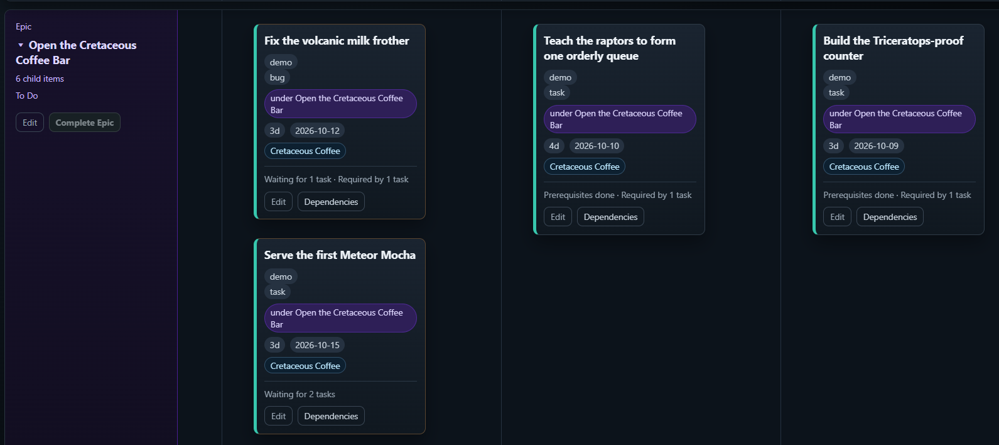

The Board keeps an Epic and its tasks together while each task moves through its own workflow.

Drag Board cards to reorder them within a column or insert them at a chosen position in another column. A line marks the insertion point, and the target column is highlighted. For example, drag the second To Do card before the third Done card to change both its status and position. The manual order is saved within its Epic lane. Use "Normal order" to drag when dependencies are open; "Dependency order" follows the chain instead.

"Duplicate" creates a copy with a fresh work state. Archive and Trash remove tasks from active views and allow restoration. Recurring tasks create their successor when completed.

<details>
<summary>Task editor</summary>

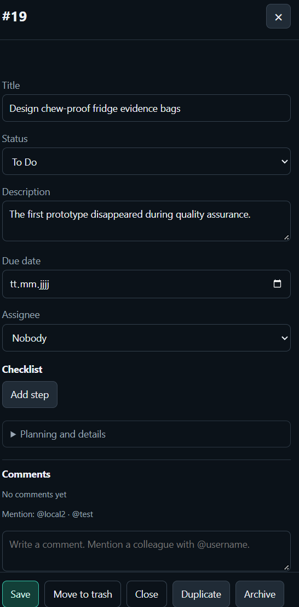

Start with a title, then add details in the editor when the task needs them. Planning fields stay in an expandable section.

</details>

Backlog keeps upcoming work grouped by Epic. Capture a title immediately, then use "Add to board" when the task is ready to be planned.

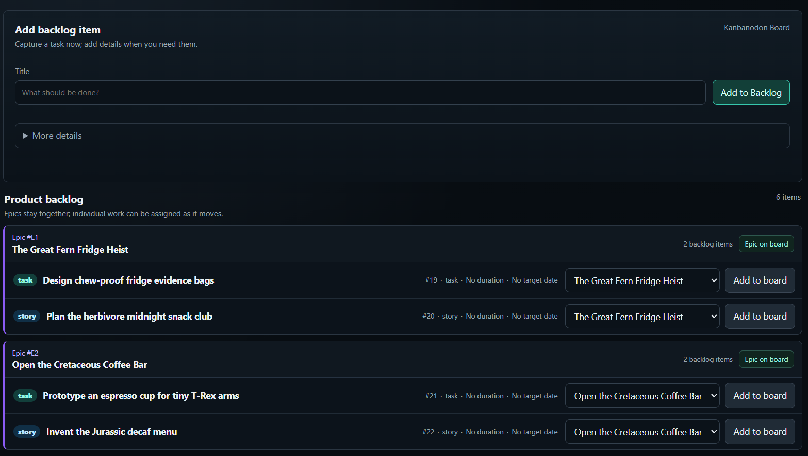

## Optional planning

### Epics and dependencies

Epics group larger pieces of work. Stories can belong to an Epic; tasks and bugs can belong to an Epic or Story. A board without Epics uses the available width for its workflow columns.

Dependencies identify work that must finish first and the tasks it enables. Tasks can enter "In Progress" with unfinished prerequisites. "Review", "Done", and later workflow stages require completed prerequisites. While dragging toward a blocked column, the Board highlights it red and shows the unfinished tickets in a tooltip. The server rejects dependency cycles. Dragging a card changes its status and manual position; use "Parent" in the editor to change its parent.

Select "Dependencies" beside "Edit" to preview the complete connected chain, including its predecessors, successors, and branches. Unrelated tasks fade. Numbering starts at 1 for tasks without predecessors; each dependent stage adds one. Colors progress from blue at the start, through gold in the middle, to teal at the end, with mixed colors for intermediate stages. Parallel tasks at the same stage share a color. A two-stage chain uses blue and teal. Frames and outgoing arrows use the source task’s color. Arrows point to dependent tasks, and scrolling keeps their routes unchanged. Hover over an arrow to highlight its endpoints and fade other arrows and tasks. Hover over a task to show all its incoming and outgoing arrows and their neighboring tasks. Moving away restores the opened chain's appearance; hovering in the normal view does not open dependencies. Hovering over a numbered source shows that source's outgoing arrows and neighbors.

"Focus tasks" hides unrelated work while keeping the whole connected chain. Each other task in the focused view has a focus button for selecting it without losing the rest of the chain. The highlighted "Show other tasks" button returns to the preview. The highlighted "Back" button, "Back to normal view" above the task area, and "Close dependencies" in the top bar close the dependency view. The selected task has a thicker frame, and the view identifies its reference and title. These actions work in Board, Overview, and Timeline; focused Timeline fits the connected tasks’ dates. Click a task or use "Edit" to open its editor. Epic titles expand or collapse their child tasks in all three views; the Epic summary remains visible.

The "Sort tasks" selector in the dependency bar switches between "Dependency order" and "Normal order" in all three views. Dependency order places connected tasks by stage within their Epic and, in Board, their status column. Normal order uses Board's ticket order, Overview's chosen table column, or Timeline's hierarchy and schedule. In Overview, click a column heading to sort by it; click it again to reverse the direction. Doing this while dependencies are open also selects Normal order. Numbers, colors, and links keep their dependency meaning whichever sort is selected. Closing the dependency view restores normal sorting; these display choices never change saved task positions.

<details>
<summary>Dependency views and hover highlighting</summary>

Board keeps the workflow columns visible while showing the connected chain and a clear frame around the selected task.

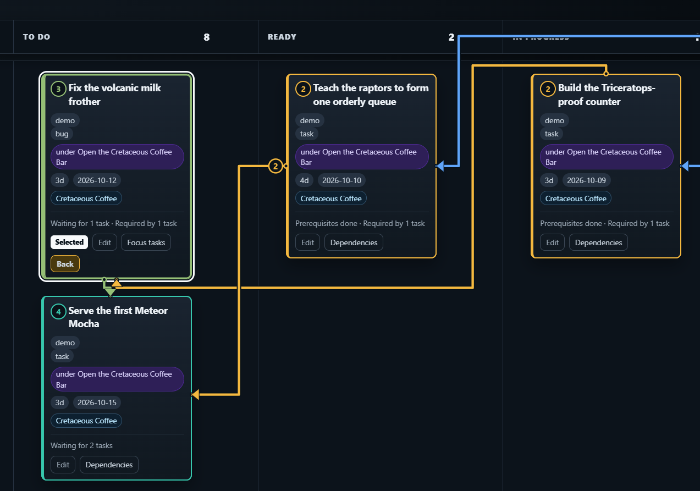

Overview shows the same stages and colors in the ticket table.

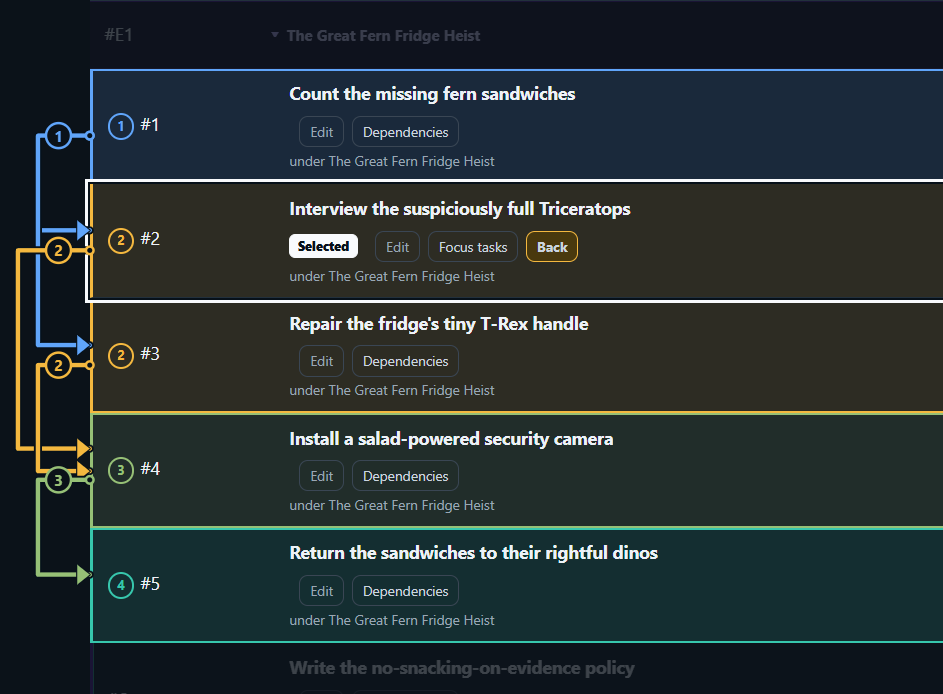

Timeline places connections beside the planned task bars.

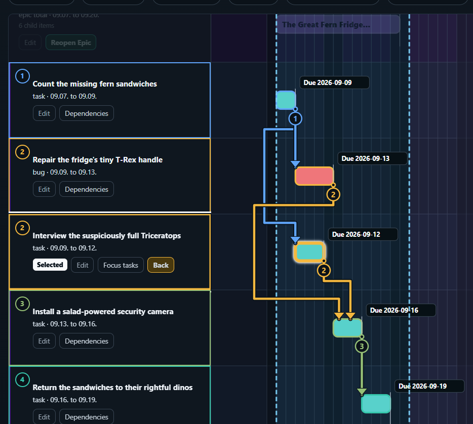

Hovering over a task keeps its incoming and outgoing connections visible while unrelated work fades.

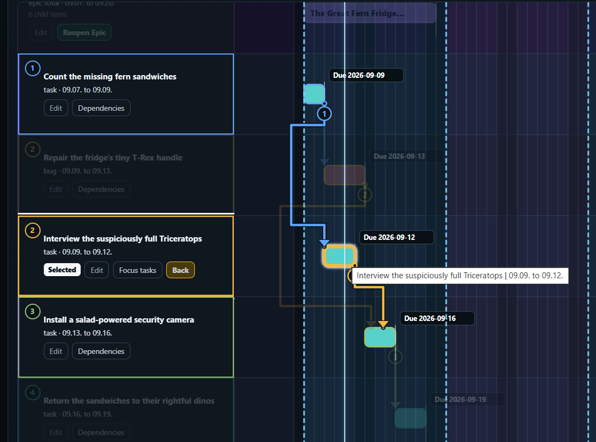

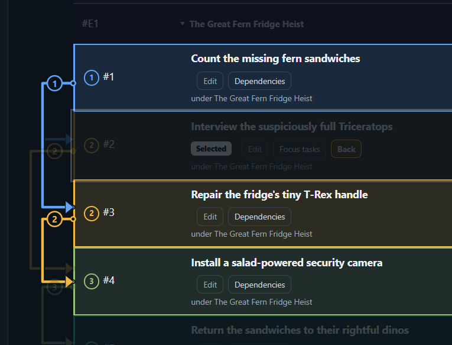

</details>

### Sprints

The "Sprints" panel is available in Board, Overview, and Timeline. Configure the first Sprint start date and a duration of 1 to 52 whole weeks in Board, then save. Sprint cards appear after a successful save. Following Sprints are calculated from the saved cadence. Changing the cadence fields marks them as unsaved and leaves the saved cards unchanged until the next successful save. Sprint names can be edited directly in Board; without a custom name, a Sprint is called "Sprint N".

Use the arrows beside the six Sprint cards to browse earlier or later Sprints. The current Sprint is shown first by default, followed by the next five; before the cadence starts, the panel shows the first six. Browsing cards does not select a Sprint. Before Sprint 1, the earlier arrow is disabled and its tooltip reads "No earlier sprints".

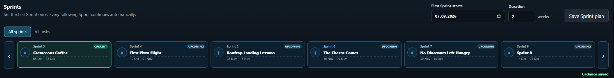

The current Sprint has a teal highlight; choosing another Sprint marks that card as selected. "All sprints" clears the Sprint selection.

Select a Sprint to show only its tasks in Board or Overview, while keeping their matching Epic headings. Timeline fits the Sprint's date range and initially shows only planned intervals touching that Sprint, including work crossing its boundaries. “Show all tasks” restores every row while retaining those dates; “Only tasks in this sprint” narrows the rows again. The selected card is highlighted and marked "Selected"; the selection stays active when switching between these three views. "All sprints", or selecting the same card again, clears the selection. With no Sprint selected, Board and Overview show all tasks and Timeline shows its complete date range. The current Sprint is not selected automatically.

Epics may span several Sprints through their tasks. Board moves empty, filtered-out, and completed Epics into the compact “Epics without visible tasks” list, keeping them editable without large empty lanes. “Complete Epic” is available when every active planned descendant is Done; Backlog, archived, and trashed work does not block it. “Reopen Epic” returns it to the first open workflow column before adding or reopening planned work.

A task belongs to the Sprint in which it is planned to finish: its due date, when available, otherwise its start date plus duration. Tasks without a usable date remain unscheduled. Sprint assignment does not calculate team capacity.

Dependency inspection in Board and Overview stays within the selected Sprint. Choose "All sprints" to inspect connections across Sprint boundaries.

### Overview, Timeline, and History

Overview and Timeline are directly available in the sidebar. Overview initially shows five main table columns; "Show planning columns" displays the additional fields.

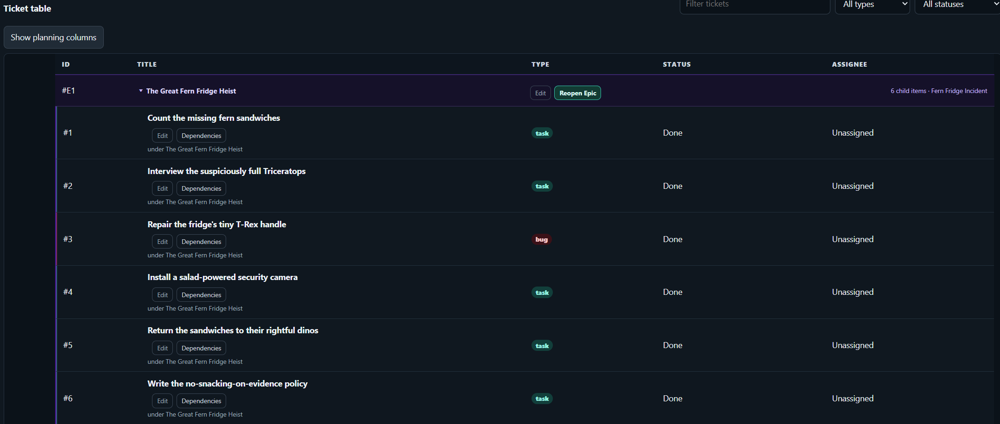

Timeline uses stored durations and dates. When duration is missing, it assumes three days for ordinary tasks and one day for Epics. When the start date is missing, it derives the start from the due date and duration, or from the creation date. The interface explains these assumptions; they are not saved as task dates.

Task bars show planned work; saved time, delays, and dashed completion estimates appear on a thin separate rail. Unfinished tasks can show a red delay up to the current date, followed by a dashed estimate. Task names remain in the left pane and within sufficiently wide bars. Epic totals use the same time grid. Use "Dependencies" beside the task name to inspect its connections. Zoom changes the time grid's density; dragging pans the timeline horizontally. The date cursor shows the calendar day under the pointer.

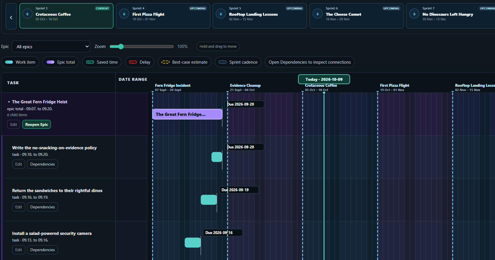

Sprint boundaries and dated headers show where each Sprint begins and ends. The persistent "Today" line marks the current day.

History is a separate sidebar view of actual completions, newest first, with Epic, type, date, and text filters. Each completion preserves its title, Epic, due date, and actual timestamp even after edits or reopening. Recorded In Progress starts produce elapsed work bars; unknown starts produce completion markers. Red bars show late completion past the saved due day. Archived work remains visible; trash is hidden and permanent deletion removes its history. Earlier, imported, and demo completions are identified separately. History episodes are retained in database backups but are not included in planning board exports.

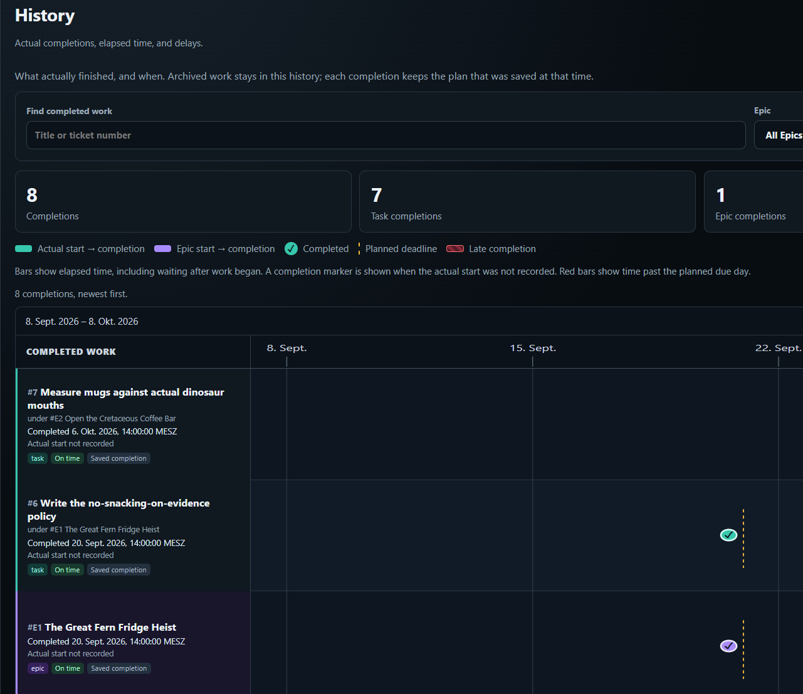

This example includes earlier completions without a recorded start, so History shows completion markers rather than assuming a work interval from planned dates.

## Accounts and permissions

| Role | Responsibilities |
| --- | --- |
| User | Create, edit, and complete tasks on accessible boards |
| Board owner | Manage access to owned boards |
| Administrator | Manage accounts, roles, password resets, and access to all boards |
| Operator | Configure the service, secure transport, and back up data |

Registration can be disabled with `KANBANODON_ALLOW_SIGNUP`. Administrators can still create accounts. Avatars are assigned automatically by the server.

An administrator password reset signs the affected account out on all devices. Changing your own password keeps the current session and signs out other sessions. Password recovery is handled by an administrator; email-based recovery is not available.

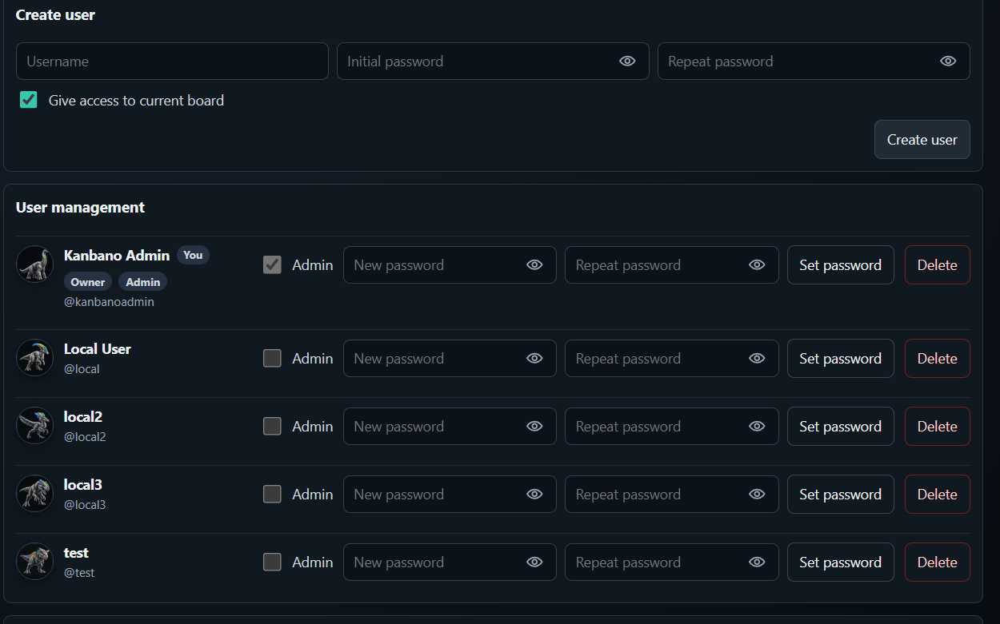

## Installation and operation

### Docker Compose

Docker with Docker Compose and a modern browser are required.

1. Replace `KANBANODON_SESSION_SECRET` in `docker-compose.yml` with a long, random value of your own.
2. Start the application:

   ```sh
   docker compose up -d --build
   ```

3. Open [localhost:8080](http://localhost:8080) in your browser.
4. On a fresh installation, log in with the initial administrator account:

   ```text
   Username: kanbanoadmin
   Password: kanbanopw
   ```

5. Set the new administrator password when prompted.

The supplied Compose configuration binds the service to `127.0.0.1:8080`, making it accessible only from the same machine. Network access requires appropriate port exposure and a reverse proxy with TLS.

Stop the application:

```sh
docker compose down
```

### Configuration

| Variable | Service default | Purpose |
| --- | --- | --- |
| `KANBANODON_ADDR` | `:8080` | HTTP listen address |
| `KANBANODON_DATA_DIR` | `data` | Database directory; `/data` inside the Docker container |
| `KANBANODON_AUTH_MODE` | `local` | Authentication mode; use `local` for normal operation |
| `KANBANODON_ALLOW_SIGNUP` | `true` | Allows account registration |
| `KANBANODON_SESSION_SECRET` | `change-me-kanbanodon` | Secret used to sign session tokens; replace it for real use |

### Storage and backups

Docker Compose uses the named volume `kanbanodon-data`. It contains `app.db` for application data and `config.db` for configuration and initialization state. Both files belong in a complete backup. For a consistent file backup, stop the service first or use a backup method designed for SQLite.

Database migrations run automatically at startup and retain existing data. The initial administrator account is created only for a fresh installation. Deleting or demoting it remains effective after a restart. An established installation without an administrator requires recovery from a suitable backup; startup does not restore a known default password.

### Export and import

The board menu exports a board as JSON. Import adds the contained tasks to the selected destination board. Repeating an import creates additional copies. Accounts and access rights are not transferred; assignments are reset during import.

Checklists, recurrence, Archive and Trash status, and comments with timestamps and author names are transferred. Comment authors are marked as imported instead of being associated with unrelated accounts that have the same numeric IDs in the destination. Activity logs and notifications are not part of a board export.

A board export supplements backups but does not replace a backup of the entire installation.

For disposable demonstrations, use [clear-task-data.ps1](scripts/clear-task-data.ps1) on Windows or [clear-task-data.sh](scripts/clear-task-data.sh) in a POSIX shell to empty task data and Sprint plans. The matching [PowerShell seed script](scripts/seed-demo-data.ps1) and [shell seed script](scripts/seed-demo-data.sh) fill boards with three dated example Epics, current Sprints, and matching Backlog tasks. Run cleanup followed by seeding to refresh old examples. Both operations use a one-shot maintenance container and leave ordinary startup flags unchanged. The separate Compose flags remain available, disabled by default. See [test data instructions](docs/demo-data.md) for commands, Docker discovery, and cleanup details.

## Architecture


```mermaid
flowchart LR
    Browser["Browser interface"] -->|HTTP and JSON| Server["Go service"]
    Server --> Data[("app.db")]
    Server --> Configuration[("config.db")]
    Browser --> File["Board export as JSON"]
```

The Go service serves the interface and API from the same address. It validates sessions, board access, input, and task relationships before saving. Persistence uses SQLite through `modernc.org/sqlite`; no separate database service is needed.

The browser interface consists of HTML, CSS, and JavaScript. Hash routes preserve the selected view, board, task, and Sprint focus in the URL. Data loading and rendering happen in the browser; the server enforces permissions and persistent validation.

| Component | Contents |
| --- | --- |
| `cmd/server/main.go` | Service configuration and HTTP routes |
| `cmd/server/auth.go`, `users.go` | Accounts, sessions, and passwords |
| `cmd/server/boards.go` | Boards, sharing, and Sprint planning |
| `cmd/server/tickets.go`, `task_features.go` | Tasks, relationships, comments, recurrence, and data exchange |
| `cmd/server/migrate.go` | Database setup and migrations |
| `web/static/` | Browser interface, routing, styles, and bundled images |
| `Dockerfile`, `docker-compose.yml` | Container and runtime configuration |

`app.db` contains accounts, sessions, boards, access rules, tasks, columns, Sprint data, labels, dependencies, comments, milestones, activity, and notifications. `config.db` contains service configuration and initialization state.

## Limitations

Kanbanodon uses one application process with local SQLite files. TLS termination and complete backups are handled by the deployment environment. Cloud synchronization and email integration are not available. Sprint planning assigns work by planned completion dates; it does not calculate capacity or balance workloads automatically.
